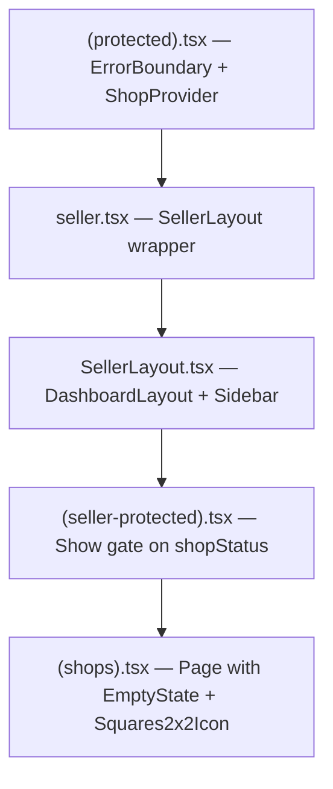

# Hydration Mismatch Audit — `/app/seller/shops`

**Date:** 2026-03-19
**Page:** `http://localhost:3000/app/seller/shops`
**Error:** `Hydration Mismatch. Unable to find DOM nodes for hydration key`

---

## Error Summary

The browser shows a full-page error with the `Squares2x2Icon` SVG markup dumped as text. The console logs show the error originates from `ProtectedLayout ErrorBoundary` and traces back to `Squares2x2Icon` rendering.

---

## Rendering Chain

The route `/app/seller/shops` passes through these layout components in order:



---

## Root Cause

> [!CAUTION]
> `createAsync` resolves **synchronously on the server** but starts as `undefined` on the client. Any `Show`/ternary that depends on async data will produce **different DOM trees** between SSR and hydration — causing hydration failure.

### How SolidStart SSR Works

| Phase | `createAsync` value | What renders |
|---|---|---|
| **Server-side render** | Resolved data (query runs inline) | Full DOM with icons, sidebar links, page content |
| **Client hydration** | `undefined` (loading) | Empty/fallback DOM — no icons, no sidebar links |

Solid's hydration algorithm walks the server HTML and tries to attach reactivity to existing DOM nodes. When the client produces a **different** tree than what the server rendered, it can't find the expected nodes → **hydration mismatch**.

---

## Affected Files & Lines

### 1. [SellerLayout.tsx](file:///home/shafayat/Desktop/ByteForge/projects/byte-forge-frontend/src/components/layout/dashboard/SellerLayout.tsx#L22-L35)

**Lines 22–35** — Sidebar links conditionally rendered based on async `shop()` data:

```tsx
links: !isLoading() && hasShop()
    ? [
        { href: "/app/seller", icon: Squares2x2Icon, ... },   // line 26
        { href: "/app/seller/shops", icon: ShoppingBagIcon, ... },
    ]
    : [],  // ← Client renders THIS (empty) during hydration
```

- **Server:** `shop()` resolves → `hasShop()` is `true` → icons rendered in sidebar
- **Client:** `shop()` is `undefined` → `isLoading()` is `true` → empty array → no icons
- **Result:** Server HTML has SVG nodes that client can't find

---

### 2. [(seller-protected).tsx](file:///home/shafayat/Desktop/ByteForge/projects/byte-forge-frontend/src/routes/(protected)/app/seller/(seller-protected).tsx#L26)

**Line 26** — Page children gated on async `shopStatus()`:

```tsx
<Show when={!isStatusLoading() && shopStatus()}>
    {props.children}
</Show>
```

- **Server:** `shopStatus()` resolves → `Show` renders children (the shops page)
- **Client:** `shopStatus()` is `undefined` → `Show` renders nothing
- **Result:** Entire shops page content (including the second `Squares2x2Icon`) is missing during hydration

---

### 3. [(shops).tsx](file:///home/shafayat/Desktop/ByteForge/projects/byte-forge-frontend/src/routes/(protected)/app/seller/(seller-protected)/shops/(shops).tsx#L37)

**Line 37** — Icon passed as JSX prop to `EmptyState`:

```tsx
icon={<Squares2x2Icon class="w-12 h-12 text-forest-300" />}
```

This is the page-level SVG that becomes part of the mismatched DOM when the `Show` gate in `(seller-protected).tsx` differs between server and client.

---

## The Fix: Wrap Async-Dependent UI in `<Suspense>`

`<Suspense>` is SolidStart's built-in mechanism for handling the SSR→hydration transition for async data. It tells Solid: *"this subtree depends on async data — coordinate the server and client rendering accordingly."*

### Why `<Suspense>` Fixes This

| Without Suspense | With Suspense |
|---|---|
| Server renders resolved content inline | Server renders resolved content inline |
| Client sees `undefined`, renders **different** DOM | Client sees `undefined`, shows **fallback** — Solid knows to **wait** before hydrating this subtree |
| Hydration walks into mismatched DOM → crash | Once async resolves, Solid **replaces** the fallback with the real content — no mismatch |

`<Suspense>` acts as a **hydration boundary**. Solid serializes the async data and streams it to the client. The client knows to wait for that data before attempting to render the subtree, avoiding the mismatch entirely.

---

### Fix 1: `(seller-protected).tsx`

Replace the `Show` gate with `Suspense`:

```diff
-import { Show, createEffect, ParentComponent } from "solid-js";
+import { Suspense, createEffect, ParentComponent } from "solid-js";
 import { useShop } from "~/lib/context/shop-context";

 const SellerProtectedLayout: ParentComponent = (props) => {
     const { shopStatus, isStatusLoading } = useShop();
     const navigate = useNavigate();

     createEffect(() => {
         const status = shopStatus();
         const loading = isStatusLoading();
         if (loading) return;
         if (status === null) {
             navigate("/app/seller/setup-shop", { replace: true });
             return;
         }
     });

     return (
-        <Show when={!isStatusLoading() && shopStatus()}>
-            {props.children}
-        </Show>
+        <Suspense>
+            {props.children}
+        </Suspense>
     );
 };
```

> [!IMPORTANT]
> The `createEffect` already handles the redirect logic for `null` status. The `Show` gate was **redundant** and the source of the mismatch. `Suspense` properly coordinates the async boundary.

---

### Fix 2: `SellerLayout.tsx`

Wrap the sidebar config computation so it doesn't produce different link arrays during hydration:

```diff
 const sidebarConfig = createMemo<SidebarConfig>(() => ({
     mode: "seller",
     brandColor: "terracotta",
     workspaceTitle: t("common.sellerWorkspace"),
-    links: !isLoading() && hasShop()
-        ? [
+    links: [
-            {
+        {
             href: "/app/seller",
             icon: Squares2x2Icon,
             label: t("common.dashboard"),
-            },
+        },
-            {
+        {
             href: "/app/seller/shops",
             icon: ShoppingBagIcon,
             label: t("common.shops"),
-            },
-        ]
-        : [],
+        },
+    ],
 }));
```

> [!NOTE]
> Since `SellerLayout` is already behind the `(seller-protected)` guard (which handles the "no shop" redirect), the sidebar links can be rendered unconditionally. If the user has no shop, they'll be redirected before seeing the sidebar anyway. This eliminates the second source of server/client DOM mismatch.

---

## Summary Table

| File | Line(s) | Problem | Fix |
|---|---|---|---|
| [(seller-protected).tsx](file:///home/shafayat/Desktop/ByteForge/projects/byte-forge-frontend/src/routes/(protected)/app/seller/(seller-protected).tsx) | 26 | `Show` gate on async data → different DOM during hydration | Replace `Show` with `Suspense` |
| [SellerLayout.tsx](file:///home/shafayat/Desktop/ByteForge/projects/byte-forge-frontend/src/components/layout/dashboard/SellerLayout.tsx) | 22–35 | Conditional sidebar links based on async `shop()` → empty array during hydration | Render links unconditionally (guard already handles redirect) |
| [(shops).tsx](file:///home/shafayat/Desktop/ByteForge/projects/byte-forge-frontend/src/routes/(protected)/app/seller/(seller-protected)/shops/(shops).tsx) | 37 | Victim — no change needed | N/A (fixed by upstream changes) |
